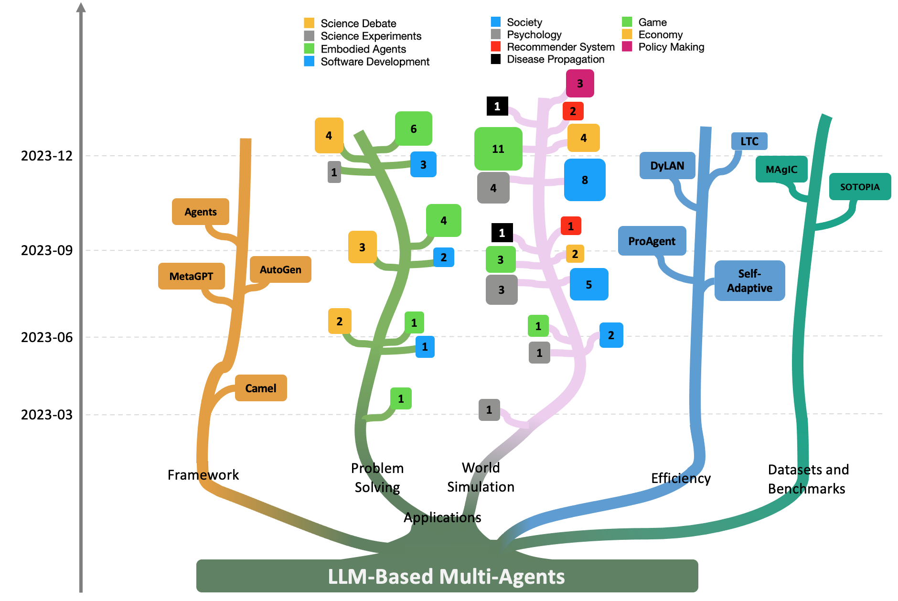
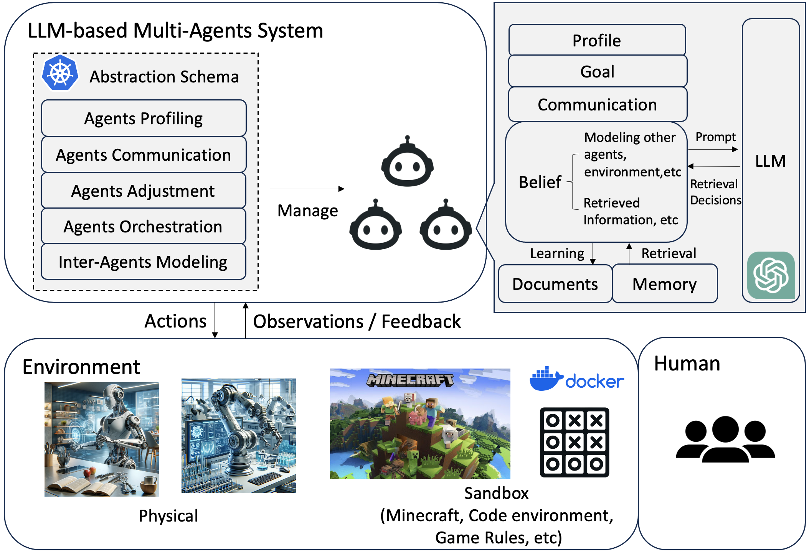
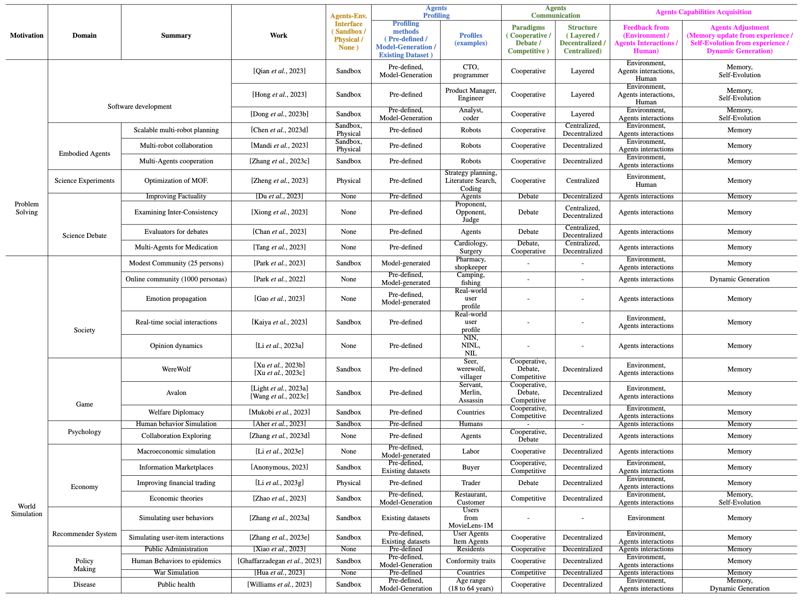

<h1 align="center"> 🤖 Awesome LLM-based Multi-Agents Papers </h1>

  🔥 <a href="https://arxiv.org/abs/2402.01680" target="_blank">Paper</a> </a> 🔥  

    
 

# 🔥Our Survey Paper
Our survey about LLM based Multi-Agents is available at: https://arxiv.org/abs/2402.01680

Our summarized LLM-based Multi-Agents architecture is: 

    
 

 

The Overview table is as follows. More details can be seen in our paper. Very appreciate any suggestions.

    
 

# 🆕 News

[2024/02] We will update our paper list every two weeks and include all the following papers in the next version of our paper. Please Feel free to contact me in case we have missed any papers!

[2024/01] This repo is created to maintain LLM-based Multi-Agents papers. We categorized these papers into five main streams:
- Multi-Agents Framework
- Multi-Agents Orchestration and Efficiency
- Multi-Agents for Problem Solving
- Multi-Agents for World Simulation
- Multi-Agents Datasets and Benchmarks

<!-- # Citation
Should you find value in our paper and this repository, we would be most grateful if you could cite our paper:
 -->

# 📌 Table of Content (ToC)

- [Multi-Agents Framework](#multi-agents-framework)
- [Multi-Agents Orchestration and Efficiency](#multi-agents-orchestration-and-efficiency)
- [Multi-Agents for Problem Solving](#multi-agents-for-problem-solving)
  * [Software development](#software-development)
  * [Embodied Agents](#embodied-agents)
  * [Science Team for Experiment Operations](#science-team-for-experiment-operations)
  * [Science Debate](#science-debate)
  * [Database](#database)
- [Multi-Agents for World Simulation](#multi-agents-for-world-simulation)
  * [Society](#society)
  * [Game](#game)
  * [Psychology](#psychology)
  * [Economy](#economy)
  * [Recommender System](#recommender-system)
  * [Policy Making](#policy-making)
  * [Disease propagation Simulation](#disease-propagation-simulation)
- [Multi-Agents Datasets and Benchmarks](#multi-agents-datasets-and-benchmarks)
- [Contributing](#contributing)
- [Contact](#contact)

# Multi-Agents Framework

\[2023/10\] OpenAgents: An Open Platform for Language Agents in the Wild. Tianbao Xie et al. [\[paper\]](https://arxiv.org/abs/2310.10634)

\[2023/10\] MetaAgents: Simulating Interactions of Human Behaviors for LLM-based Task-oriented Coordination via Collaborative Generative Agents. Yuan Li et al. [\[paper\]](https://arxiv.org/abs/2310.06500)

\[2023/09\] AutoAgents: A Framework for Automatic Agent Generation. Guangyao Chen et al. [\[paper\]](https://arxiv.org/abs/2309.17288)

\[2023/09\] Agents: An Open-source Framework for Autonomous Language Agents. Wangchunshu Zhou et al. [\[paper\]](https://arxiv.org/abs/2309.07870)

\[2023/08\] AgentVerse: Facilitating Multi-Agent Collaboration and Exploring Emergent Behaviors. Weize Chen et al. [\[paper\]](https://arxiv.org/abs/2308.10848)

\[2023/08\] AutoGen: Enabling Next-Gen LLM Applications via Multi-Agent Conversation. Qingyun Wu et al. [\[paper\]](https://arxiv.org/abs/2308.08155)

\[2023/08\] MetaGPT: Meta Programming for A Multi-Agent Collaborative Framework. Sirui Hong et al. [\[paper\]](https://arxiv.org/abs/2308.00352)

\[2023/03\] CAMEL: Communicative Agents for “Mind” Exploration of Large Language Model Society. Guohao Li et al. [\[paper\]](https://arxiv.org/abs/2303.17760)

# Multi-Agents Orchestration and Efficiency

\[2024/02\] More Agents Is All You Need. Junyou Li et al. [\[paper\]](https://arxiv.org/abs/2402.05120)

\[2023/11\] crewAI. joaomdmoura et al. [\[repo\]](https://github.com/joaomdmoura/crewAI) 

\[2023/10\] Dynamic LLM-Agent Network: An LLM-agent Collaboration Framework with Agent Team Optimization. Zijun Liu et al. [\[paper\]](https://arxiv.org/abs/2310.02170)

\[2023/10\] Adapting LLM Agents Through Communication. Kuan Wang et al. [\[paper\]](https://arxiv.org/abs/2310.01444)

\[2023/08\] ProAgent: Building Proactive Cooperative AI with Large Language Models. Ceyao Zhang et al. [\[paper\]](https://arxiv.org/abs/2308.11339)

\[2023/07\] Self-Adaptive Large Language Model (LLM)-Based Multiagent Systems. Nathalia Nascimento et al. [\[paper\]](https://arxiv.org/abs/2307.06187)

\[2023/07\] Unleashing Cognitive Synergy in Large Language Models: A Task-Solving Agent through Multi-Persona Self-Collaboration. Zhenhailong Wang et al. [\[paper\]](https://arxiv.org/abs/2307.05300)

\[2023/05\] Encouraging Divergent Thinking in Large Language Models through Multi-Agent Debate. Tian Liang et al. [\[paper\]](https://arxiv.org/abs/2305.19118)

# Multi-Agents for Problem Solving 
## Software development

\[2024/02\] Can Large Language Models Serve as Data Analysts? A Multi-Agent Assisted Approach for Qualitative Data Analysis. Zeeshan Rasheed et al. [\[paper\]](https://arxiv.org/abs/2402.01386)

\[2024/01\] XUAT-Copilot: Multi-Agent Collaborative System for Automated User Acceptance Testing with Large Language Model. Zhitao Wang et al. [\[paper\]](https://arxiv.org/abs/2401.02705)

\[2023/12\] AgentCoder: Multi-Agent-based Code Generation with Iterative Testing and Optimisation. Dong Huang et al. [\[paper\]](https://arxiv.org/abs/2312.13010)

\[2023/08\] MetaGPT: Meta Programming for A Multi-Agent Collaborative Framework. Sirui Hong et al. [\[paper\]](https://arxiv.org/abs/2308.00352)

\[2023/07\] Communicative agents for software development. Chen Qian et al. [\[paper\]](https://arxiv.org/abs/2307.07924)

\[2023/04\] Self-collaboration Code Generation via ChatGPT. Yihong Dong et al. [\[paper\]](https://arxiv.org/abs/2304.07590)

## Embodied Agents
\[2023/10\] Multi-Agent Consensus Seeking via Large Language Models. Huaben Chen et al.  [\[paper\]](https://arxiv.org/abs/2310.20151)

\[2023/10\] Co-NavGPT: Multi-Robot Cooperative Visual Semantic Navigation using Large Language Models. Bangguo Yu et al. [\[paper\]](https://arxiv.org/abs/2310.07937)

\[2023/09\] Scalable Multi-Robot Collaboration with Large Language Models: Centralized or Decentralized Systems?. Yongchao Chen et al. [\[paper\]](https://arxiv.org/abs/2309.15943v1)

\[2023/07\] RoCo: Dialectic Multi-Robot Collaboration with Large Language Models. Zhao Mandi et al. [\[paper\]](https://arxiv.org/abs/2307.04738)

\[2023/07\] Building Cooperative Embodied Agents Modularly with Large Language Models. Hongxin Zhang et al. [\[paper\]](https://arxiv.org/abs/2307.02485)

\[2023/02\] Collaborating with language models for embodied reasoning. Ishita Dasgupta et al. [\[paper\]](https://arxiv.org/abs/2302.00763)

## Science Team for Experiment Operations

\[2024/01\] ProtAgents: Protein discovery via large language model multi-agent collaborations combining physics and machine learning. A. Ghafarollahi et al. [\[paper\]](https://arxiv.org/abs/2402.04268)

\[2023/11\] ChatGPT Research Group for Optimizing the Crystallinity of MOFs and COFs. Zhiling Zheng et al. [\[paper\]](https://www.ncbi.nlm.nih.gov/pmc/articles/PMC10683477/)

\[2023/04\] ChemCrow: Augmenting large-language models with chemistry tools. Andres M Bran et al. [\[paper\]](https://arxiv.org/abs/2304.05376)

\[2023/04\] Emergent autonomous scientific research capabilities of large language models. Daniil A. Boiko et al. [\[paper\]](https://arxiv.org/abs/2304.05332)

## Science Debate

\[2024/01\] Enhancing Diagnostic Accuracy through Multi-Agent Conversations: Using Large Language Models to Mitigate Cognitive Bias. Yu He Ke et al. [\[paper\]](https://arxiv.org/abs/2401.14589)

\[2023/11\] MechAgents: Large language model multi-agent collaborations can solve mechanics problems, generate new data, and integrate knowledge. Bo Ni et al. [\[paper\]](https://arxiv.org/abs/2311.08166)

\[2023/11\] MedAgents: Large Language Models as Collaborators for Zero-shot Medical Reasoning. Xiangru Tang et al. [\[paper\]](https://arxiv.org/abs/2311.10537)

\[2023/08\] ChatEval: Towards Better LLM-based Evaluators through Multi-Agent Debate. Chi-Min Chan et al. [\[paper\]](https://arxiv.org/abs/2308.07201)

\[2023/05\] Improving Factuality and Reasoning in Language Models through Multiagent Debate. Yilun Du et al. [\[paper\]](https://arxiv.org/abs/2305.14325)

\[2023/05\] Examining Inter-Consistency of Large Language Models Collaboration: An In-depth Analysis via Debate. Kai Xiong et al. [\[paper\]](https://arxiv.org/abs/2305.11595)

## Database

\[2023/12\] D-Bot: Database Diagnosis System using Large Language Models.  et al. [\[paper\]](https://arxiv.org/abs/2312.01454)

\[2023/08\] LLM As DBA.  et al. [\[paper\]](https://arxiv.org/abs/2308.05481)

# Multi-Agents for World Simulation
## Society

\[2023/12\] Large Language Model Enhanced Multi-Agent Systems for 6G Communications. Feibo Jiang et al. [\[paper\]](https://arxiv.org/abs/2312.07850)

\[2023/10\] Multi-Agent Consensus Seeking via Large Language Models. Huaben Chen et al. [\[paper\]](https://arxiv.org/abs/2310.20151)

\[2023/10\] Lyfe Agents: Generative agents for low-cost real-time social interactions. Zhao Kaiya et al. [\[paper\]](https://arxiv.org/abs/2310.02172)

\[2023/08\] Quantifying the Impact of Large Language Models on Collective Opinion Dynamics. Chao Li et al. [\[paper\]](https://arxiv.org/abs/2308.03313)

\[2023/07\] S3 Social-network Simulation System with Large Language Model-Empowered Agents. Chen Gao et al. [\[paper\]](https://arxiv.org/abs/2307.14984)

\[2023/07\] Are you in a Masquerade? Exploring the Behavior and Impact of Large Language Model Driven Social Bots in Online Social Networks. Siyu Li et al. [\[paper\]](https://arxiv.org/abs/2307.10337)

\[2023/05\] Can Large Language Models Transform Computational Social Science?. Caleb Ziems et al. [\[paper\]](https://arxiv.org/abs/2305.03514)

\[2023/04\] Generative Agents- Interactive Simulacra of Human Behavior. Joon Sung Park et al. [\[paper\]](https://arxiv.org/abs/2304.03442)

\[2022/10\] Social simulacra: Creating populated prototypes for social computing systems. Joon Sung Park et al. [\[paper\]](https://dl.acm.org/doi/abs/10.1145/3526113.3545616)

## Game

\[2023/12\] Can Large Language Models Serve as Rational Players in Game Theory? A Systematic Analysis. Caoyun Fan et al. [\[paper\]](https://arxiv.org/abs/2312.05488)

\[2023/11\] ALYMPICS: Language Agents Meet Game Theory. Shaoguang Mao et al. [\[paper\]](https://arxiv.org/abs/2311.03220v2)

\[2023/10\] Language Agents with Reinforcement Learning for Strategic Play in the Werewolf Game. Zelai Xu et al. [\[paper\]](https://arxiv.org/abs/2310.18940)

\[2023/10\] Theory of Mind for Multi-Agent Collaboration via Large Language Models. Huao Li et al. [\[paper\]](https://arxiv.org/abs/2310.10701)

\[2023/10\] Welfare Diplomacy: Benchmarking Language Model Cooperation. Gabriel Mukobi et al. [\[paper\]](https://arxiv.org/abs/2310.08901)

\[2023/10\] GameGPT: Multi-agent Collaborative Framework for Game Development. Dake Chen et al. [\[paper\]](https://arxiv.org/abs/2310.08067)

\[2023/10\] AVALONBENCH: Evaluating LLMs Playing the Game of Avalon. Jonathan Light et al. [\[paper\]](https://arxiv.org/abs/2310.05036)

\[2023/10\] Avalon’s Game of Thoughts: Battle Against Deception through Recursive Contemplation. Shenzhi Wang et al. [\[paper\]](https://arxiv.org/abs/2310.01320)

\[2023/09\] MindAgent: Emergent Gaming Interaction. Ran Gong et al. [\[paper\]](https://arxiv.org/abs/2309.09971)

\[2023/09\] Exploring Large Language Models for Communication Games: An Empirical Study on Werewolf. Yuzhuang Xu et al. [\[paper\]](https://arxiv.org/abs/2309.04658v1)

\[2023/05\] Playing repeated games with Large Language Models. Elif Akata et al. [\[paper\]](https://arxiv.org/abs/2305.16867)

## Psychology

\[2023/07\] Understanding the Benefits and Challenges of Using Large Language Model-based Conversational Agents for Mental Well-being Support. Zilin Ma et al. [\[paper\]](https://arxiv.org/abs/2307.15810)

\[2023/07\] The SocialAI School: Insights from Developmental Psychology Towards Artificial Socio-Cultural Agents. Grgur Kovač et al. [\[paper\]](https://arxiv.org/abs/2307.07871)

\[2022/10\] Exploring Collaboration Mechanisms for LLM Agents: A Social Psychology View. Jintian Zhang et al. [\[paper\]](https://arxiv.org/abs/2310.02124)

\[2022/08\] Using Large Language Models to Simulate Multiple Humans and Replicate Human Subject Studies. Gati Aher et al. [\[paper\]](https://arxiv.org/abs/2208.10264)

## Economy

\[2023/10\] CompeteAI: Understanding the Competition Behaviors in Large Language Model-based Agents. Qinlin Zhao et al. [\[paper\]](https://arxiv.org/abs/2310.17512)

\[2023/10\] Large Language Model-Empowered Agents for Simulating Macroeconomic Activities. Nian Li et al. [\[paper\]](https://arxiv.org/abs/2310.10436)

\[2023/09\] Rethinking the Buyer’s Inspection Paradox in Information Markets with Language Agents.  et al. [\[paper\]](https://openreview.net/forum?id=6werMQy1uz)

\[2023/09\] TradingGPT: Multi-Agent System with Layered Memory and Distinct Characters for Enhanced Financial Trading Performance. Yang Li et al. [\[paper\]](https://arxiv.org/abs/2309.03736)

\[2023/01\] Large Language Models as Simulated Economic Agents: What Can We Learn from Homo Silicus?. John J. Horton et al. [\[paper\]](https://arxiv.org/abs/2301.07543)

## Recommender System

\[2023/10\] On Generative Agents in Recommendation. An Zhang et al. [\[paper\]](https://arxiv.org/abs/2310.10108)

\[2023/10\] AgentCF: Collaborative Learning with Autonomous Language Agents for Recommender Systems. Junjie Zhang et al. [\[paper\]](https://arxiv.org/abs/2310.09233)

## Policy Making

\[2023/11\] War and Peace (WarAgent): Large Language Model-based Multi-Agent Simulation of World Wars. Wenyue Hua et al. [\[paper\]](https://arxiv.org/abs/2311.17227)

\[2023/11\] Simulating Public Administration Crisis: A Novel Generative Agent-Based Simulation System to Lower Technology Barriers in Social Science Research. Bushi Xiao et al. [\[paper\]](https://arxiv.org/abs/2311.06957)

\[2023/10\] Multi-Agent Consensus Seeking via Large Language Models. Huaben Chen et al. [\[paper\]](https://arxiv.org/abs/2310.20151)

\[2023/09\] Generative Agent-Based Modeling: Unveiling Social System Dynamics through Coupling Mechanistic Models with Generative Artificial Intelligence. Navid Ghaffarzadegan et al. [\[paper\]](https://arxiv.org/abs/2309.11456)

## Disease propagation Simulation
\[2023/07\] Epidemic modeling with generative agents. Ross Williams et al. [\[paper\]](https://arxiv.org/abs/2307.04986)

<!-- # Multi-Agents for Dialogue Dataset Generation -->

# Multi-Agents Datasets and Benchmarks

\[2023/11\] Towards Reasoning in Large Language Models via Multi-Agent Peer Review Collaboration. Zhenran Xu et al. [\[paper\]](https://arxiv.org/abs/2311.08152)

\[2023/11\] MAgIC: Investigation of Large Language Model Powered Multi-Agent in Cognition, Adaptability, Rationality and Collaboration. Lin Xu et al. [\[paper\]](https://arxiv.org/abs/2311.08562)

\[2023/10\] SOTOPIA: Interactive Evaluation for Social Intelligence in Language Agents. Xuhui Zhou et al. [\[paper\]](https://arxiv.org/abs/2310.11667)

\[2023/10\] Evaluating Multi-Agent Coordination Abilities in Large Language Models. Saaket Agashe et al. [\[paper\]](https://arxiv.org/abs/2310.03903)

\[2023/09\] LLM-Deliberation: Evaluating LLMs with Interactive Multi-Agent Negotiation Games. Sahar Abdelnabi et al. [\[paper\]](https://arxiv.org/abs/2309.17234)

# Contributing
Because the LLM-based Multi-Agents is a fast-growing research field, we may miss some important related papers. Very welcome contributions to this repository! Please feel free to submit a pull request or open an issue if you have anything to add or comment. 

Thanks!

# Contact
Taicheng Guo
- Email: tguo2@nd.edu
- Twitter: https://twitter.com/taioooorange

